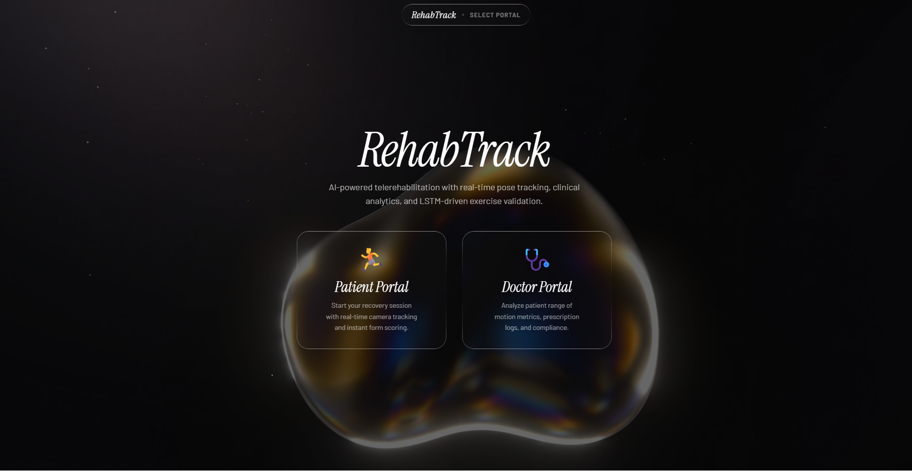
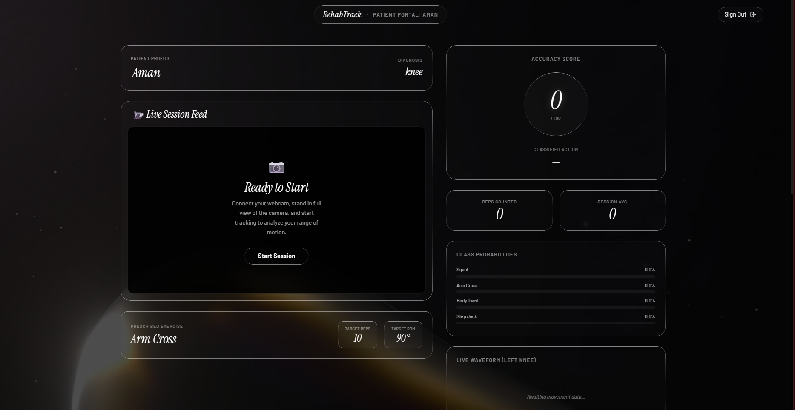
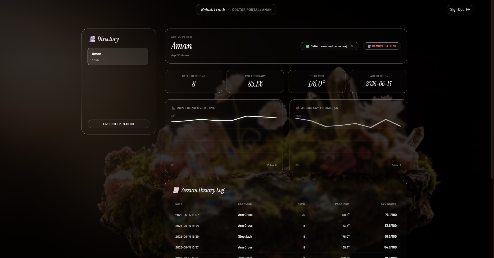

# 🏥 RehabTrack AI

> An AI-powered telerehabilitation monitoring system that enables remote physical therapy through real-time pose analysis and progress tracking.


---

## 📌 Overview

RehabTrack AI bridges the gap between patients and physiotherapists by leveraging computer vision and deep learning to monitor rehabilitation exercises remotely. The system captures body movements via webcam, classifies exercises in real-time using a BiLSTM model, and provides structured feedback through role-based dashboards for both doctors and patients.

This project was developed as an independent B.Tech project at the **Indian Institute of Information Technology, Raichur** (Department of Mathematics & Computing).

---

## ✨ Features

- 🎯 **Real-time Pose Tracking** — MediaPipe BlazePose extracts 33 body landmarks per frame
- 🧠 **AI Exercise Classification** — BiLSTM model classifies exercises over sliding windows of pose sequences
- 👨‍⚕️ **Role-Based Dashboards** — Separate views for doctors and patients with access control
- 📈 **Progress Monitoring** — Track patient exercise history, accuracy, and improvement over sessions
- 🔒 **Secure Auth** — Login system with role differentiation (Doctor / Patient)
- 💾 **Session Persistence** — SQLite database stores all session and progress data

---

## 🛠️ Tech Stack

| Layer | Technology |
|-------|-----------|
| Pose Estimation | MediaPipe BlazePose |
| ML Model | BiLSTM (Bidirectional LSTM) |
| Backend | Python, Flask, SQLite |
| Frontend | React.js |
| Styling | CSS |

---

## 🏗️ System Architecture

```
Webcam Input
     │
     ▼
MediaPipe BlazePose
(33 pose landmarks per frame)
     │
     ▼
Sliding Window Buffer
(sequence of N frames)
     │
     ▼
BiLSTM Classifier
(exercise type + rep count)
     │
     ▼
Flask REST API  ◄──────► SQLite Database
     │
     ▼
React Frontend
├── Doctor Dashboard (assign, monitor, review)
└── Patient Dashboard (perform, track progress)
```

---

## 📁 Project Structure

```
RehabTrack-AI/
├── backend/
│   ├── app.py               # Flask entry point
│   ├── model/
│   │   ├── bilstm_model.py  # BiLSTM architecture
│   │   └── predict.py       # Inference pipeline
│   ├── pose/
│   │   └── extractor.py     # MediaPipe landmark extraction
│   ├── routes/
│   │   ├── auth.py          # Login / register endpoints
│   │   ├── patient.py       # Patient data endpoints
│   │   └── doctor.py        # Doctor data endpoints
│   ├── database.db          # SQLite database (auto-generated)
│   └── requirements.txt
│
├── frontend/
│   ├── public/
│   └── src/
│       ├── components/
│       ├── pages/
│       │   ├── DoctorDashboard.jsx
│       │   └── PatientDashboard.jsx
│       └── App.jsx
│
└── README.md
```

---

## ⚙️ Setup & Installation

### Prerequisites
- Python 3.8+
- Node.js 16+
- Webcam

---

### Backend

```bash
# Clone the repository
git clone https://github.com/blankaman9-cyber/RehabTrack-AI.git
cd RehabTrack-AI/backend

# Create virtual environment
python -m venv venv
source venv/bin/activate      # On Windows: venv\Scripts\activate

# Install dependencies
pip install -r requirements.txt

# Run Flask server
python app.py
```

Backend runs at `http://localhost:5000`

---

### Frontend

```bash
cd RehabTrack-AI/frontend

# Install dependencies
npm install

# Start React app
npm start
```

Frontend runs at `http://localhost:3000`

---

## 🧠 Model Details

| Property | Value |
|----------|-------|
| Architecture | Bidirectional LSTM |
| Input | Sequence of pose landmark vectors (sliding window) |
| Landmark Source | MediaPipe BlazePose (33 keypoints × 3 coords = 99 features/frame) |
| Output | Exercise class + confidence score |
| Training Data | Custom dataset of rehabilitation exercises |

---

## 👥 User Roles

### 👨‍⚕️ Doctor
- View all assigned patients
- Monitor real-time and historical exercise sessions
- Assign exercise programs
- Review accuracy and completion metrics

### 🧑‍🦽 Patient
- Perform assigned exercises with live pose feedback
- View personal progress over time
- Track rep counts and session history

---

## 📸 Screenshots

### 🏠 Landing Page — Portal Selection

> Elegant dark-themed entry point with role-based portal selection (Patient / Doctor)

---

### 🧑‍🦽 Patient Portal — Live Session

> Real-time webcam feed with live accuracy scoring, rep counting, class probabilities (Squat, Arm Cross, Body Twist, Step Jack), prescribed exercise display, and live ROM waveform

---

### 👨‍⚕️ Doctor Portal — Analytics Dashboard

> Full patient analytics view with total sessions, average accuracy (85.1%), peak ROM (176°), ROM trend graph, accuracy progress chart, and detailed session history log

---

## 🔮 Future Scope

- Mobile app integration (React Native)
- Voice-guided exercise instructions
- Anomaly detection for injury prevention alerts
- Cloud deployment (AWS / GCP)
- Video call integration between doctor and patient

---

## 👨‍💻 Author

**Aman Raj Kumar**
B.Tech in Mathematics & Computing
Indian Institute of Information Technology, Raichur
📧 mc25b1005@iiitr.ac.in

---

## 📄 License

This project is for academic purposes under IIIT Raichur.

---

> *Built as part of the B.Tech Independent Project — IIIT Raichur, 2025*
